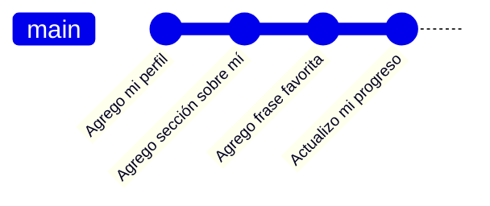
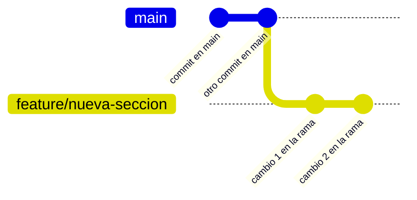
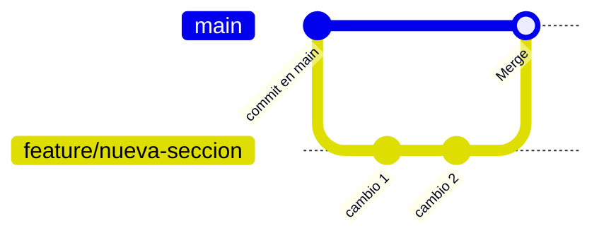
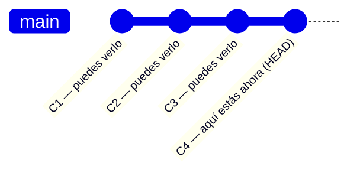
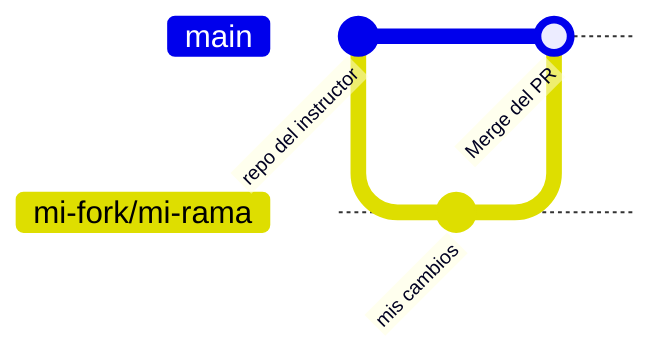
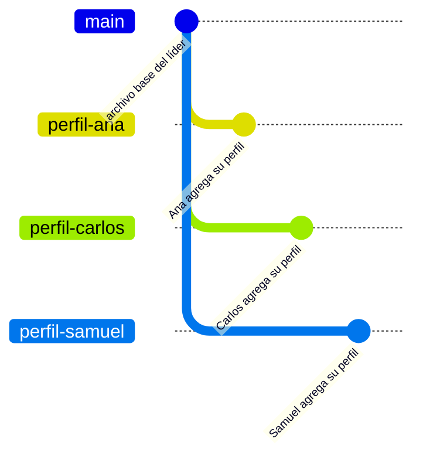
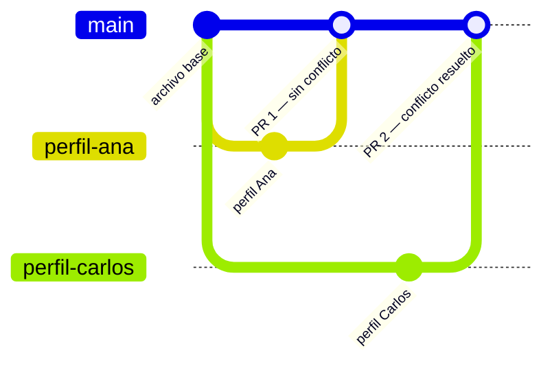

<div align="center">

# Curso Básico: Git para Principiantes

Bienvenido al curso. Aquí encontrarás todo lo que necesitas para seguir la sesión y repasar cada paso por tu cuenta.

<br>

<a href="https://git-scm.com/install/" title="Descargar Git">
  
</a>
&nbsp;&nbsp;&nbsp;&nbsp;
<a href="https://github.com" title="GitHub">
  
</a>

</div>

---

<div align="center">
  
  &nbsp;&nbsp;&nbsp;&nbsp;

  <br><br>
  <em>Curso organizado por la Facultad de Matemáticas de la UADY · Vinculación FMAT </em>
</div>

---

## <font color="#179287">Información del curso</font>

| Salón | Horario |
|---|---|
| CC4 | 9:00 – 13:00 |

---

## <font color="#179287">Herramientas y recursos</font>

| Recurso | Enlace |
|---|---|
| Presentación del curso (Canva) | [Abrir presentación](https://canva.link/wh9mf15zqpmq94i) |
| Descargar Git | [git-scm.com/install](https://git-scm.com/install/) |
| Crear cuenta en GitHub | [github.com](https://github.com) |
| Descargar GitHub Desktop | [desktop.github.com](https://desktop.github.com/download/) |
| Descargar VS Code | [code.visualstudio.com](https://code.visualstudio.com/) |
| Extensión GitLens | Buscar `GitLens` en VS Code → Extensions (`Ctrl+Shift+X`) |
| Extensión Git Graph | Buscar `Git Graph` en VS Code → Extensions (`Ctrl+Shift+X`) |

---

## <font color="#179287">Antes de empezar — Requisitos</font>

- [ ] Laptop con Git instalado
- [ ] VS Code instalado
- [ ] Cuenta de GitHub creada y correo verificado
- [ ] GitHub Desktop instalado y cuenta vinculada
- [ ] Extensiones de VS Code instaladas: **GitLens** y **Git Graph**

---

## <font color="#179287">Guía paso a paso para el alumno</font>

### <font color="#F05032">Bloque 1 — Introducción *(teoría)*</font>

Esta parte es solo de escuchar y observar. El instructor explicará:

- Qué problema resuelve el control de versiones (¿Qué pasa sin Git?)
- La diferencia entre **Git** (la herramienta local) y **GitHub** (la plataforma en la nube)
- Por qué usamos **GitHub Desktop**: para ver gráficamente lo que Git hace "por dentro"

---

### 📝 Actividad Markdown #1 — Tu primer archivo

> Antes de tocar Git, practica Markdown. Abre VS Code, crea un archivo llamado `mi-perfil.md` en tu escritorio y escribe lo siguiente:

```markdown
# Mi nombre aquí

## Sobre mí
- Carrera:
- Semestre:
- Una cosa que espero aprender hoy:

## Mi frase favorita
> Escribe aquí una frase que te guste.
```

**Elementos que practicaste:** `#` encabezados, `-` listas, `>` citas en bloque.

> Guarda el archivo. Lo usarás durante todo el curso.

---

### <font color="#F05032">Bloque 2 — Setup e interfaz *(teoría)*</font>

El instructor hará un tour en vivo de GitHub Desktop. Observa dónde están:

| Zona | Qué hace |
|---|---|
| **Current Repository** (arriba izquierda) | Muestra el repo activo; desde aquí cambias entre proyectos |
| **Current Branch** (arriba centro) | Indica la rama donde estás trabajando |
| **Changes** (panel izquierdo) | Lista los archivos modificados listos para hacer commit |
| **History** (pestaña izquierda) | Muestra el historial de commits del proyecto |
| **Publish / Push origin** (arriba derecha) | Sube tus cambios a GitHub |

> Si aún no conectaste tu cuenta: ve a **File → Options → Accounts** y haz clic en **Sign In** con GitHub.

---

### 📝 Actividad Markdown #2 — Negritas, cursiva y código

> Abre `mi-perfil.md` en VS Code y agrega una nueva sección al final:

```markdown
## Herramientas del curso

| Herramienta | Para qué sirve |
|---|---|
| **Git** | Control de versiones local |
| **GitHub** | Plataforma en la nube |
| **GitHub Desktop** | Interfaz gráfica para Git |
| **VS Code** | Editor de archivos |

Hoy aprenderé a usar `git commit` por primera vez.
```

**Elementos que practicaste:** `**negritas**`, tablas con `|`, código en línea con `` ` ``.

---

### <font color="#F05032">Bloque 3 — Conceptos fundamentales *(teoría)*</font>

Tres ideas clave antes de empezar:

| Concepto | Qué es |
|---|---|
| **Repositorio (repo)** | Una carpeta que Git vigila y registra su historial |
| **Commit** | Una fotografía del proyecto en un momento dado (tiene autor, mensaje y un código único llamado *hash*) |
| **Rama (branch)** | Una línea de tiempo alterna donde puedes hacer cambios sin afectar `main` |

---

### 📝 Actividad Markdown #3 — Listas de tareas

> Agrega al final de `mi-perfil.md` esta sección y ve marcando cada casilla conforme avances en el curso:

```markdown
## Mi progreso en el curso

- [ ] Cree mi primer repositorio
- [ ] Hice mi primer commit
- [ ] Cree una rama nueva
- [ ] Hice un merge
- [ ] Subí mi repo a GitHub
- [ ] Mandé un Pull Request
- [ ] Resolví un conflicto
```

**Elemento que practicaste:** listas de tareas con `- [ ]` y `- [x]`.

---

### <font color="#F05032">Bloque 4 — Primer repositorio + commits *(individual)*</font>

**Paso 1 — Crea el repositorio en GitHub Desktop**
1. Abre GitHub Desktop → `File` → `New Repository`
2. En **Name** escribe el nombre de tu proyecto (ejemplo: `mi-proyecto-git`)
3. En **Local Path** elige dónde quieres que se guarde (por ejemplo, tu Escritorio)
4. Haz clic en `Create Repository`
5. GitHub Desktop creará la carpeta automáticamente y la mostrará lista en el panel principal

> **Nota:** GitHub Desktop siempre crea una carpeta nueva con el nombre que escribiste. No selecciones una carpeta ya existente como Local Path — el resultado sería una carpeta dentro de otra.

**Paso 2 — Mueve tu archivo al repositorio**
1. Abre el Explorador de archivos (Windows) o Finder (Mac)
2. Localiza `mi-perfil.md` (lo guardaste en el Escritorio al inicio)
3. Muévelo dentro de la carpeta que GitHub Desktop acaba de crear (ejemplo: `Escritorio/mi-proyecto-git/`)

**Paso 3 — Haz tu primer commit**
1. En el panel **Changes** verás `mi-perfil.md` como archivo nuevo
2. Activa la casilla junto al archivo (debe quedar con ✓)
3. En el campo **Summary** (abajo a la izquierda) escribe: `Agrego mi perfil`
4. Haz clic en **Commit to main**
5. Verás el commit en la pestaña **History**

**Ejercicio:** agrega contenido nuevo a `mi-perfil.md` y repite los pasos del **Paso 3** (activar la casilla del archivo, escribir el mensaje y hacer commit) hasta tener **3 o 4 commits**. Observa cómo el historial crece con cada uno.

> **Así se ve tu historial hasta ahora:**



---

### <font color="#F05032">Bloque 5 — Ramas (branches) *(individual)*</font>

Una **rama** es como una línea de tiempo alterna: puedes hacer cambios sin afectar `main`.

**Paso 1 — Crea una rama nueva**
1. En GitHub Desktop, haz clic en **Current Branch** → **New Branch**
2. Escribe el nombre (ejemplo: `feature/nueva-seccion`) → `Create Branch`
3. Verás que la rama activa cambia en la barra superior

> **¿Apareció un diálogo al cambiar de rama?** Es normal — GitHub Desktop te pregunta qué hacer si tienes cambios sin commit:
>
> | Opción | Qué hace | Cuándo usarla |
> |---|---|---|
> | **Leave my changes on [rama]** | Deja los cambios en la rama actual, sin llevártelos | Cuando quieres que esos cambios queden en la rama donde los hiciste |
> | **Bring my changes to [nueva rama]** | Lleva los cambios a la rama a la que vas a cambiar | Cuando empezaste a editar en la rama equivocada |
> | **Stash changes and switch branch** | Guarda los cambios temporalmente y cambia de rama | Cuando necesitas cambiar de rama rápido sin perder ni llevar los cambios |
>
> Para este ejercicio elige **Leave my changes on [rama]** si ya hiciste cambios en `main` que quieres dejar ahí.

> **Así se ve la bifurcación en el historial:**



**Paso 2 — Haz cambios en la rama nueva**
1. Abre `mi-perfil.md` en VS Code
2. Agrega una nueva sección (ver actividad abajo)
3. Guarda, activa la casilla en **Changes**, escribe un mensaje y haz commit

**Paso 3 — Fusiona (merge) la rama a main**
1. En GitHub Desktop, ve a **Current Branch** → selecciona `main`
2. Desde el menú: `Branch` → `Merge into Current Branch`
3. Selecciona tu rama (`feature/nueva-seccion`) → `Create a merge commit`
4. En **History** verás cómo se unieron los dos caminos

> **Así se ve el merge:**



---

### 📝 Actividad Markdown #4 — Links e imágenes

> Mientras estás en tu rama nueva, agrega esta sección a `mi-perfil.md`:

```markdown
## Recursos que quiero explorar

- [GitHub Learning Lab](https://github.com/apps/github-learning-lab) — tutoriales interactivos
- [Oh My Git!](https://ohmygit.org/) — juego para aprender Git
- [Pro Git Book en español](https://git-scm.com/book/es/v2) — libro oficial gratuito

## Mis dudas hasta ahora

1. 
2. 
3. 
```

**Elementos que practicaste:** `[texto](url)` links y listas numeradas `1.`.

> Haz commit de este cambio en tu rama antes de fusionar.

---

### ☕ Descanso — 10 minutos

---

### <font color="#F05032">Bloque 6 — Push *(individual)*</font>

Ahora subiremos el repositorio local a GitHub.

**Paso 1 — Publica tu repositorio**
1. En GitHub Desktop, haz clic en **Publish repository** (botón superior derecho)
2. Elige si quieres que sea público o privado → `Publish Repository`
3. Una vez publicado, el botón cambia a **Push origin**

**Paso 2 — Verifica en GitHub**
1. Ve a [github.com](https://github.com) y abre tu repositorio
2. Confirma que `mi-perfil.md` aparece con todo tu contenido
3. Regresa a GitHub Desktop: cada vez que hagas cambios nuevos, haz clic en **Push origin** para sincronizar

> **Push, Fetch y Pull — la calle en dos direcciones:**

| Acción | Qué hace | Cuándo usarla |
|---|---|---|
| **Push** | Envía tus commits locales a GitHub | Cuando quieres subir tus cambios |
| **Fetch** | Revisa si hay cambios en GitHub, sin traerlos aún | Para asomarte sin modificar nada local |
| **Pull** | Trae los cambios de GitHub a tu computadora | Cuando quieres recibir lo que otros subieron |

> Fetch = "mirar el buzón". Pull = "meter las cartas a tu escritorio".

---

### 📝 Actividad Markdown #5 — Separadores y énfasis

> En VS Code, agrega al final de `mi-perfil.md` una sección de cierre antes de hacer push:

```markdown
---

## Reflexión del bloque

Lo que más me costó entender fue:

Lo que me quedó más claro fue:

---

*Archivo creado y editado con VS Code + GitHub Desktop*
```

**Elementos que practicaste:** `---` separador horizontal, texto en cursiva con `*`.

---

### <font color="#F05032">Bloque 7 — Viajando en el historial *(individual)*</font>

Git guarda cada commit como un punto en el tiempo. Puedes visitar cualquiera de ellos sin romper el presente.

**Ver el historial en GitHub Desktop**
1. Ve a la pestaña **History**
2. Haz clic en cualquier commit para ver exactamente qué cambió (verde = agregado, rojo = quitado)

**Ver quién escribió cada línea con GitLens**
1. Abre `mi-perfil.md` en VS Code
2. Pasa el cursor sobre cualquier línea — aparecerá quién la escribió y cuándo
3. Esto se llama **blame** y es muy útil para entender por qué está ese texto ahí

**Ver el árbol de ramas con Git Graph**
1. En VS Code, abre la paleta de comandos (`Ctrl+Shift+P` / `Cmd+Shift+P`)
2. Escribe `Git Graph: View Git Graph` y selecciónalo
3. Verás un mapa visual de todos tus commits y ramas

> **Mirar el historial no cambia nada.** Es como pausar un video en un minuto exacto: puedes ver ese fotograma y después seguir desde donde estás.



---

### <font color="#F05032">Bloque 8 — Si algo sale mal *(individual)*</font>

Antes de trabajar en equipo, conoce los botones de "deshacer". Git tiene uno para cada situación:

| Situación | Qué usar | Dónde está |
|---|---|---|
| Guardaste el archivo pero **no hiciste commit** | **Discard changes** | Clic derecho sobre el archivo en *Changes* → GitHub Desktop |
| Hiciste commit pero **no hiciste push** | **Undo commit** | Botón "Undo" que aparece justo después de comitear en GitHub Desktop — desaparece si navegas a otra pantalla, así que úsalo de inmediato |
| Estás en medio de un merge conflictivo y quieres cancelar todo | **Abort merge** | Botón visible en GitHub Desktop durante el conflicto |
| Ya hiciste push y el commit está en GitHub | **Revert commit** | Clic derecho sobre el commit en *History* → Revert |

> **Revert no borra la historia** — crea un commit nuevo que deshace el anterior. Es la opción más segura cuando ya compartiste tus cambios con otros.

---

### <font color="#F05032">Bloque 9 — Fork + colaboración en equipo + Pull Request *(equipos)*</font>

Antes de tocar GitHub Desktop, entiende las dos ideas nuevas de este bloque.

---

#### ¿Qué es un Fork?

Un **fork** es una copia completa de un repositorio ajeno que queda bajo tu cuenta de GitHub. Es como fotocopiar un libro para poder subrayarlo sin tocar el original.

| | Repo original (instructor) | Tu fork |
|---|---|---|
| **Dueño** | El instructor | Tú |
| **Puedes hacer push directo** | No | Sí |
| **Relación** | "upstream" | copia independiente |

---

#### ¿Qué es un Pull Request?

Un **Pull Request (PR)** es una solicitud formal para que el dueño de un repositorio acepte tus cambios. No empuja código a la fuerza — propone los cambios y abre una conversación.

El flujo completo es:

```
Tu fork/rama  →  Pull Request  →  Revisión  →  Merge (si se aprueba)
```



**¿Por qué existe el PR y no simplemente push?**

En proyectos reales nadie tiene permiso de escribir directamente en el repositorio de otro. El PR permite que el dueño:
- vea exactamente qué cambió
- deje comentarios línea por línea
- apruebe o rechace antes de que el código entre a `main`

---

#### Ejemplo concreto antes de hacerlo

Imagina que el instructor tiene el repo `instructor/GitBasic`. Tú no puedes hacer push ahí, pero sí puedes:

1. Hacer **fork** → obtienes `tu-usuario/GitBasic`
2. Crear una rama y hacer cambios ahí
3. Hacer **push** a tu fork
4. Abrir un **Pull Request** que diga: *"Quiero que aceptes estos cambios en tu repo"*
5. El instructor lo revisa → si está bien, hace **merge**

Así el instructor controla qué entra a su repositorio y puede ver el trabajo de cada equipo.

---

#### 👑 Solo el líder del equipo

**Paso 1 — Haz fork del repo del instructor**
1. Ve al repositorio del instructor en GitHub (el instructor te compartirá la URL en clase)
2. Haz clic en `Fork` (esquina superior derecha) → `Create fork`
3. Ahora tienes una copia del repo en tu cuenta: `tu-usuario/GitBasic`

**Paso 2 — Agrega a tus compañeros como colaboradores**
1. En tu fork en GitHub, ve a **Settings** → **Collaborators** → **Add people**
2. Busca el usuario de GitHub de cada compañero y agrégalos
3. Ellos recibirán un correo de invitación — avísales que lo acepten antes de continuar

**Paso 3 — Clona tu fork en GitHub Desktop**
1. Abre GitHub Desktop → `File` → `Clone Repository`
2. Busca tu fork (`tu-usuario/GitBasic`) → selecciona carpeta destino → `Clone`

---

#### 👥 El resto del equipo (después de aceptar la invitación)

**Paso 4 — Clona el fork del líder**
1. Abre GitHub Desktop → `File` → `Clone Repository` → pestaña **URL**
2. Pega la URL del fork del líder (el líder se las comparte)
3. Selecciona carpeta destino → `Clone`

---

#### 🤝 Todo el equipo

**Paso 5 — Practiquen Push y Pull en equipo**

*El líder hace esto primero:*
1. En GitHub Desktop, crea una rama: **Current Branch** → **New Branch** → `equipo-[nombre]`
2. Abre VS Code, crea el archivo `equipo-[nombre].md` dentro de la carpeta `answers-box/` que ya existe en el repo, y escribe algo
3. Regresa a GitHub Desktop, hace commit y luego **Push origin**

*El resto del equipo hace esto después:*

4. Haz clic en **Fetch origin** — esto le dice a GitHub Desktop que existe una rama nueva en el servidor
5. Ve a **Current Branch** → busca la rama `equipo-[nombre]` del líder → cámbiate a ella
6. Al cambiarte a esa rama, GitHub Desktop descarga automáticamente el contenido — verás el archivo del líder aparecer en tu VS Code

> **¿Por qué funciona así?** Fetch avisa que la rama existe; cambiarte a ella la descarga. No necesitas hacer Pull por separado en este caso.

**Paso 6 — Manda el Pull Request al instructor**
1. En GitHub Desktop, asegúrate de estar en la rama `equipo-[nombre]` → haz clic en **Create Pull Request** — se abrirá el navegador
2. GitHub preselecciona automáticamente el repo del instructor como destino — solo verifica que diga:
   - **base repository:** `instructor/GitBasic` ← `main`
   - **head repository:** `tu-usuario/GitBasic` ← `equipo-[nombre]`
3. Escribe un título descriptivo → `Create pull request`

> El instructor tiene `main` protegido con revisión de **codeowner** obligatoria. Solo él puede aprobar y hacer merge — ustedes no verán ese botón disponible.

**Paso 7 — Deja feedback en el PR de otro equipo**
1. Ve a la pestaña `Pull requests` del repo del instructor en GitHub
2. Abre el PR de otro equipo, léelo y deja un comentario constructivo

---

### <font color="#F05032">Bloque 10 — Proyecto final: perfiles en equipo + conflictos reales *(equipos)*</font>

> Continúan en el mismo fork del Bloque 9. El objetivo es que cada integrante agregue **su perfil** al archivo `answers-box/equipo-[nombre].md` desde su propia rama. Al hacer merge, los conflictos surgirán solos.

El archivo debe incluir esta estructura base — el líder la crea, los demás la completan:

```markdown
# Equipo [Nombre]

## Integrantes

| Nombre | Carrera | Semestre |
|---|---|---|
| | | |
| | | |

## Perfiles

<!-- cada integrante agrega aquí su sección con foto -->

## Preguntas del equipo

### ¿Qué es la ingeniería de software?
*Responde: [nombre de quien la contesta]*
### ¿Qué son las soft skills?
*Responde: [nombre de quien la contesta]*
### ¿Cómo puedes usar la IA en tu carrera sin perder el protagonismo?
*Responde: [nombre de quien la contesta]*

## Lo más valioso que aprendimos hoy
>
## Una pregunta que nos quedó pendiente
>
```

> Cada integrante contesta **una pregunta distinta** y escribe su respuesta debajo de la línea `*Responde:*` correspondiente. No hay un formato fijo — escribe lo que necesites en las líneas siguientes.

> **¿Dónde encuentro la URL de mi foto de GitHub?** Ve a tu perfil en [github.com](https://github.com), clic derecho en tu foto → "Copiar dirección de imagen".

---

**Paso 1 — El líder prepara la base**

1. En la rama `equipo-[nombre]`, el líder abre `answers-box/equipo-[nombre].md` en VS Code
2. Escribe una estructura inicial para que todos sepan qué deben llenar — sin llenar la parte de sus compañeros
3. Hace commit y **Push origin**

**Paso 2 — El resto del equipo se une a la rama del líder**

1. Haz clic en **Fetch origin**
2. Ve a **Current Branch** → busca `equipo-[nombre]` → cámbiate a ella
3. Verás el archivo base que creó el líder en tu VS Code

**Paso 3 — Cada integrante crea su propia rama desde ahí**

Todos parten de la rama `equipo-[nombre]` que ya tiene la estructura base.

1. En GitHub Desktop, asegúrate de estar en la rama `equipo-[nombre]`
2. Haz clic en **Current Branch** → **New Branch**
3. Nómbrala con tu nombre: `perfil-[tu-nombre]` (ejemplo: `perfil-ana`)
4. Haz clic en `Create Branch`

> **Así se ve el árbol cuando todos crean su rama:**



**Paso 4 — Cada integrante agrega su perfil al archivo**

1. Abre `answers-box/equipo-[nombre].md` en VS Code
2. Agrega tu sección con tu información — respeta la estructura que dejó el líder
3. En GitHub Desktop: activa la casilla del archivo → escribe el mensaje `Agrego perfil de [tu-nombre]` → **Commit to perfil-[tu-nombre]**
4. Haz clic en **Push origin**

**Paso 5 — Cada integrante manda un Pull Request hacia la rama del líder**

1. En GitHub (navegador), ve al fork del líder
2. GitHub detectará tu rama recién subida y mostrará un botón **Compare & pull request** — haz clic
3. Verifica que el PR diga:
   - **base:** `equipo-[nombre]` ← rama del líder dentro del fork
   - **compare:** `perfil-[tu-nombre]` ← tu rama
4. Escribe un título descriptivo → `Create pull request`

**Paso 6 — El líder mergea los PRs uno por uno**

1. En GitHub, ve a la pestaña **Pull requests** del fork
2. Abre el primer PR → **Merge pull request** — sin conflicto
3. Abre el segundo PR → **Merge pull request** — aquí GitHub avisará que hay conflicto porque ambos tocaron el mismo archivo

> **A partir del segundo PR casi seguro habrá conflicto.** Eso es normal y es exactamente lo que queremos que experimenten.

**Paso 7 — El líder resuelve el conflicto**

GitHub mostrará un botón **Resolve conflicts** — al abrirlo verás marcas como estas en el archivo:

```
<<<<<<< perfil-ana
sección de Ana
=======
sección de Carlos
>>>>>>> perfil-carlos
```

1. Borra las marcas (`<<<<<<<`, `=======`, `>>>>>>>`) y **conserva ambas secciones** — el objetivo es que queden todos los perfiles juntos
2. Haz clic en **Mark as resolved** → **Commit merge**
3. Repite con los PRs restantes

> **Si el conflicto da pánico:** puedes cerrar el PR sin mergearlo y volver a intentarlo — nada se pierde.



**Paso 8 — Pull Request final al instructor**

1. En GitHub Desktop, cámbiate a `equipo-[nombre]` → haz **Fetch origin** para traer los merges que se hicieron en GitHub
2. Haz clic en **Create Pull Request** — se abrirá el navegador
3. Verifica que el PR diga:
   - **base repository:** `instructor/GitBasic` ← `main`
   - **head repository:** `tu-usuario/GitBasic` ← `equipo-[nombre]`
4. Escribe un título descriptivo → `Create pull request`

**Paso 9 — Deja feedback en el PR de otro equipo**
1. Ve a la pestaña `Pull requests` del repo del instructor en GitHub
2. Abre el PR de otro equipo y deja un comentario constructivo

> El instructor revisará y mergeará los PRs. Una vez aceptados, entren al repositorio del instructor en GitHub — verán los perfiles de **todos los equipos** juntos en `answers-box/`. Esa es la foto final del trabajo colectivo.

---

## <font color="#179287">Referencia rápida de Markdown</font>

| Sintaxis | Resultado |
|---|---|
| `# Título` | Encabezado grande |
| `## Subtítulo` | Encabezado mediano |
| `**texto**` | **negrita** |
| `*texto*` | *cursiva* |
| `- elemento` | lista con viñeta |
| `1. elemento` | lista numerada |
| `- [ ] tarea` | casilla sin marcar |
| `- [x] tarea` | casilla marcada |
| `[texto](url)` | link |
| `> texto` | cita en bloque |
| `` `código` `` | código en línea |
| `---` | línea divisoria |

---

## <font color="#179287">Recursos para seguir practicando</font>

- [GitHub Learning Lab](https://github.com/apps/github-learning-lab) — tutoriales interactivos directamente en GitHub
- [Oh My Git!](https://ohmygit.org/) — juego visual para aprender Git
- [Pro Git Book](https://git-scm.com/book/es/v2) — libro oficial de Git en español (gratuito)
- [Markdown Guide](https://www.markdownguide.org/) — referencia completa de Markdown
