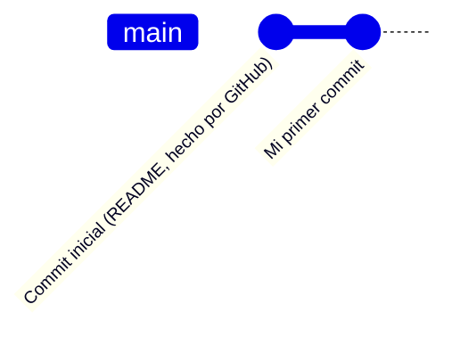
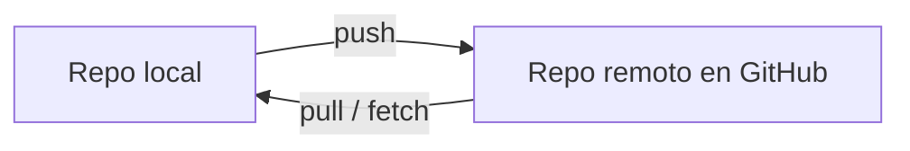
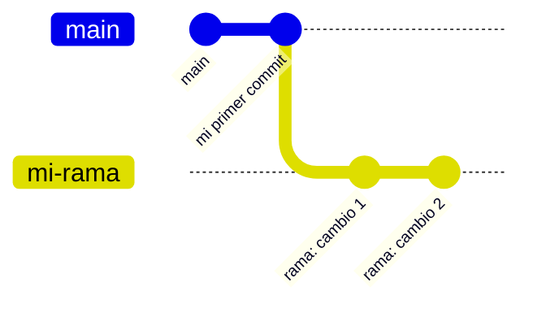
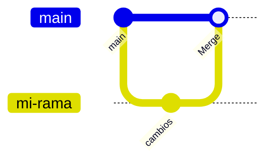
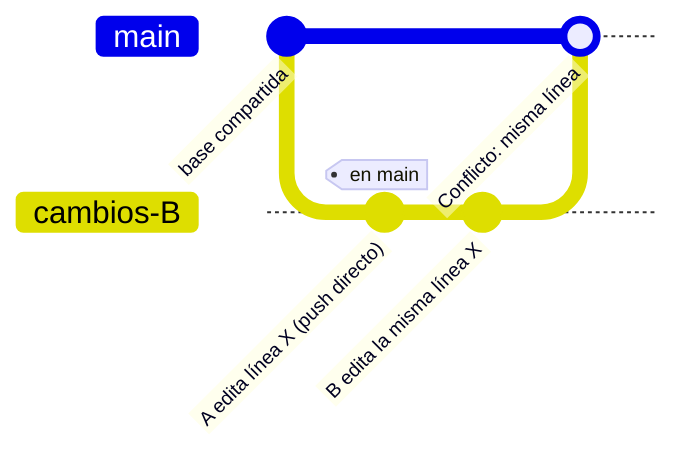
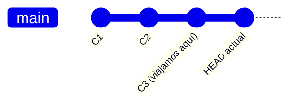
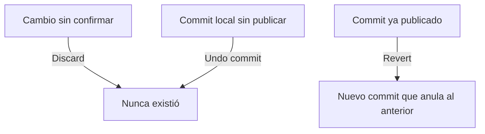
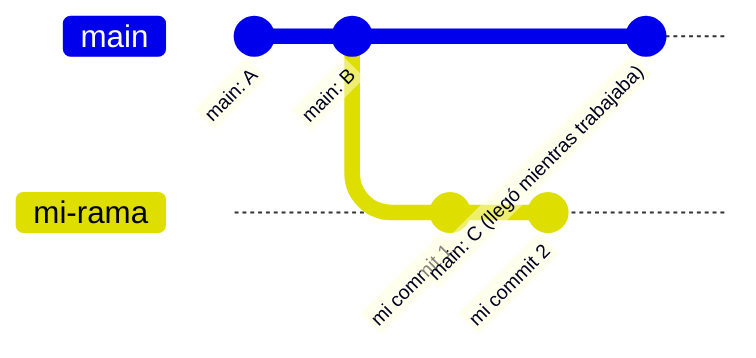
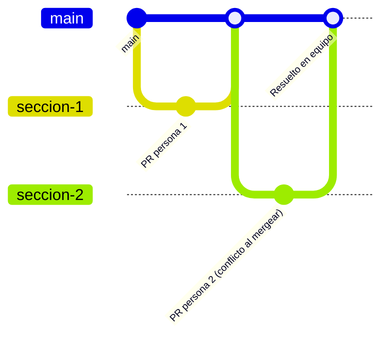

# Guion de clase: Git y GitHub para principiantes
## Versión: 1 sesión de 4 horas (intensiva)

> Formato de la clase: **cero código en pantalla**. Todo se enseña navegando interfaces gráficas: **GitHub Desktop**, **GitHub.com** y **Visual Studio Code** (con extensiones); la terminal se usa **solo si es estrictamente inevitable**. Esta versión es la condensación de la versión de 2 sesiones (8h) en un solo bloque de 4 horas: mismo arco narrativo, mismas escenas, menos tiempo de exploración libre por escena.

---

## 0. Filosofía del guion (léelo antes de dar la clase)

Misma lógica que la versión larga: cada escena existe para generar una pregunta que **solo la siguiente escena resuelve** (pull antes de push, ramas antes de merge, merge antes de conflicto, conflicto antes de "botón de pánico", abortar antes de rebase, y todo junto al final en el ejercicio colaborativo). La diferencia frente a la versión de 8 horas no es el contenido, es el **colchón**: aquí casi no hay tiempo de exploración libre, así que el instructor debe ser más directivo y decidir de antemano qué preguntas se responden en el momento y cuáles se dejan para después de clase.

**Recomendación crítica para esta versión:** dado que no hay tiempo para recuperar atrasos, verifica en los primeros 2 minutos que **todos** los alumnos ya tienen cuenta de GitHub y las herramientas instaladas (ver Acto 0). Si alguien no las tiene, sepáralo con un asistente o dale acceso a una máquina/perfil ya configurado; no pauses al grupo completo.

### Mapa general (storyboard): 240 minutos

| # | Escena | Tema del temario | Duración | Herramienta protagonista |
|---|--------|-------------------|----------|--------------------------|
| - | Acto 0 | Preparación previa | (antes de clase) | - |
| 1 | Escena 1 | Qué es GitHub + Nace tu repo (clone/pull + commit) | 30 min | GitHub Web + Desktop |
| 2 | Escena 2 | El ida y vuelta: Push y Pull | 25 min | GitHub Desktop + Web |
| - | - | *Descanso* | 10 min | - |
| 3 | Escena 3 | Bifurcación en una rama + historiales separados | 30 min | GitHub Desktop + VS Code |
| 4 | Escena 4 | Merge (el reencuentro) | 25 min | GitHub Desktop + GitHub Web (PR) |
| 5 | Escena 5 | Conflictos de merge | 30 min | VS Code (editor de merge) |
| - | - | *Descanso* | 10 min | - |
| 6 | Escena 6 | Checkout de commits: viajar en el historial | 20 min | GitHub Desktop (History) + GitLens |
| 7 | Escena 7 | Abortar un commit / deshacer | 15 min | GitHub Desktop + VS Code |
| 8 | Escena 8 | Force y Rebase (la zona peligrosa) | 15 min | GitHub Desktop |
| 9 | Escena 9 | Git colaborativo: repo entre varias personas | 30 min | GitHub Web (Pull Requests) |
| - | - | Cierre y recursos | 5 min | - |

**Suma de control:** 30+25+10+30+25+30+10+20+15+15+30+5 = 245 min ≈ 4h con margen de 5 min para arranque. Si el grupo va atrasado, los primeros recortes recomendados son, en este orden: el "camino B" de la Escena 4 (PR, dejar solo merge local), la mención opcional de terminal en la Escena 8, y la profundidad del ejercicio de revisión de código en la Escena 9 (dejar solo un revisor por PR en vez de rotar).

---

## Acto 0: Preparación previa (antes de la clase)

1. Cuenta de GitHub creada y verificada por cada alumno **antes** de llegar.
2. Instalados previamente: **GitHub Desktop**, **Visual Studio Code**, Git del sistema.
3. Extensión de VS Code ya instalada antes de clase (no se instala en vivo, no hay tiempo): **GitLens**.
   - El árbol visual de ramas y commits (**Graph**) ya viene integrado en el panel de Control de código fuente de VS Code: no hay que instalar nada aparte para eso.
   - No se necesita la extensión "GitHub Pull Requests and Issues": todo el flujo de Pull Requests (crear, revisar, comentar, mergear) se cubre con **GitHub Web**, que además es donde lo verían en un trabajo real si su equipo no usa VS Code para eso.
4. Repositorio de demostración del instructor ya creado en GitHub, con un `README.md`, para el ejercicio de pull de la Escena 2.
5. Repositorio u organización compartida ya lista, con los alumnos pre-agregados como colaboradores si es posible (ahorra 5-10 minutos críticos en la Escena 9).

---

### 🎬 Escena 1: "¿Qué es esto?" + Nace tu primer repo (30 min)

**Objetivo:** entender la diferencia Git/GitHub con ejemplos visuales, y terminar con un repositorio propio, clonado, con un primer commit y ya reconocido como una simple carpeta en el disco.

**Gancho de apertura (2 min):** muestra el historial de commits de un repo real conocido. *"¿Alguna vez tuvieron un archivo llamado `final_v2_definitivo_YA.docx`? Esto es lo que lo reemplaza."*

**Guion (versión rápida):**

1. (5 min) Analogía relámpago: Git = fotografías con memoria de tu proyecto, guardadas localmente. GitHub = la casa en internet donde viven esas fotografías y donde otros pueden verlas o colaborar. Un vistazo rápido a un repo real: lista de archivos, pestaña "Commits".
2. (7 min) Crear el repo **en GitHub.com primero**: `New repository` → nombre → "Add a README file" → Create. Señalar: este README ya es el primer commit, hecho por GitHub.
3. (4 min) Clonar con **GitHub Desktop**: `File > Clone Repository` → pestaña GitHub.com → seleccionar repo → Clone. Frase clave: *"Esto que hicieron es un pull disfrazado de 'clonar'. En unos minutos van a entender por qué esto importa para explicar el push."*
4. (5 min) **Desvío rápido, pero necesario: ábrelo en el Explorador de archivos (o Finder).** Desde GitHub Desktop: `Repository > Show in Explorer` / `Show in Finder`. Muestra que es una carpeta normal, con los mismos archivos que ya vieron en GitHub.com. Activa "Elementos ocultos" (Windows) o `Cmd+Shift+.` (Mac) y señala la carpeta `.git`. Frase clave: *"Ahí adentro vive toda la magia. No hay ningún servidor escondido: es tu disco, esta carpeta. Podrían copiarla, respaldarla en un USB o mandarla por correo si quisieran."*
5. (7 min) Abrir en VS Code (botón "Open in Visual Studio Code" desde Desktop). Editar el README (agregar su nombre). Commit desde VS Code (panel de Control de código fuente) o desde Desktop: elegir uno de los dos y quedarse con ese para el resto de la clase.

**Diagrama:**

**Transición:** *"Tu commit solo existe en tu compu, en esa carpeta que acabamos de ver. ¿Cómo lo mandamos de vuelta a la nube?"*

---

### 🎬 Escena 2: El ida y vuelta, Push y Pull (25 min)

**Objetivo:** entender push/pull como una misma calle en dos direcciones, con un pull real de por medio.

**Guion (versión rápida):**

1. (7 min) **Push:** botón "Push origin" en Desktop. Refrescar GitHub.com en vivo y mostrar el cambio reflejado; momento de mayor impacto visual, no lo apures.
2. (13 min) **Pull provocado por otra persona:** los alumnos editan el `README.md` del repo de demostración del instructor **directamente desde el navegador** (ícono de lápiz → editar → commit directo). El instructor muestra en su Desktop que no aparece nada hasta hacer **Fetch** (mirar el buzón) y **Pull** (meter las cartas al escritorio).
3. (5 min) Cada alumno hace un segundo commit propio y push, para fijar el músculo.

**Diagrama:**

**Transición:** *"Todos trabajamos en una sola línea de tiempo. ¿Qué pasa si quiero probar algo arriesgado sin tocar la versión que funciona?"*

**→ Descanso: 10 min**

---

### 🎬 Escena 3: Bifurcación en una rama + historiales separados (30 min)

**Objetivo:** ver dos líneas de tiempo creciendo en paralelo sin afectarse.

**Guion (versión rápida):**

1. (5 min) Analogía: `main` es la carretera; una rama es un desvío que nace en un punto exacto y tiene sus propias paradas.
2. (5 min) Crear rama en Desktop: "Current branch" → "New branch" → nombre descriptivo → Create.
3. (10 min) Dos commits en la rama nueva, push (Publish branch). Cambiar a `main` y mostrar que ahí **no** están esos cambios.
4. (10 min) Ver el árbol en la vista **Graph** de VS Code (panel de Control de código fuente, ya integrada, sin instalar nada): mostrar visualmente la bifurcación. Recalcar el hábito de mirar siempre en qué rama se está parado (barra inferior de VS Code / selector en Desktop).

**Diagrama:**

**Transición:** *"Se ve genial tener dos historias... pero en algún momento necesitamos que se vuelvan una. ¿Cómo juntamos dos historias?"*

---

### 🎬 Escena 4: Merge, el reencuentro (25 min)

**Objetivo:** ejecutar un merge limpio (sin conflicto) por los dos caminos reales: local y por Pull Request.

**Guion (versión rápida):**

1. (8 min) **Merge local:** parado en `main` en Desktop → `Branch > Merge into current branch` → elegir la rama → Merge. Confirmar en la vista **Graph** de VS Code que las líneas se reencuentran.
2. (17 min) **Merge vía Pull Request:** nueva rama, commit, push. En GitHub.com: banner "Compare & pull request" → crear el PR → mostrar "Files changed" (mismo lenguaje visual de diff que en Desktop/VS Code) → **Merge pull request**. Volver a Desktop, hacer **Pull** en `main` y mostrar el cambio localmente (refuerzo directo de la Escena 2).

**Diagrama:**

**Transición:** *"Hoy nadie más tocó las mismas líneas, por eso el merge fue limpio. ¿Qué pasa si dos personas editan exactamente la misma línea? Eso se llama conflicto."*

---

### 🎬 Escena 5: Conflictos de merge (30 min)

**Objetivo:** provocar un conflicto real a propósito y resolverlo con el editor visual de VS Code, sin pánico.

**Guion (versión rápida):**

1. (8 min) En parejas: Persona A edita una línea del README y hace push a `main`. Persona B edita la misma línea sin haber hecho pull antes, e intenta push.
2. (5 min) Mostrar el rechazo del push en Desktop, y el aviso de conflicto al hacer Pull.
3. (12 min) Resolver en **VS Code**: explicar los bloques `<<<<<<<` / `=======` / `>>>>>>>` y los botones **Accept Current / Accept Incoming / Accept Both**. Analogía: "dos borradores del mismo párrafo, ¿cuál te quedas?". Guardar.
4. (5 min) Volver a Desktop: el conflicto ya no aparece → se arma el commit de merge → Commit → Push. Confirmar en GitHub.com.

**Diagrama:**

**Transición:** *"Resolvieron un conflicto sin perder la cabeza. Para entender bien qué pasó, a veces hay que ver el historial completo y hasta viajar a un punto anterior."*

**→ Descanso: 10 min**

---

### 🎬 Escena 6: Checkout de commits, viajar en el historial (20 min)

**Objetivo:** inspeccionar y visitar el pasado sin miedo a romper el presente.

**Guion (versión rápida):**

1. (5 min) Pestaña **History** en Desktop: recorrer commits, ver diffs. **GitLens** en VS Code: pasar el mouse sobre una línea y ver quién/cuándo la cambió (blame inline).
2. (10 min) Clic derecho sobre un commit antiguo en la vista **Graph** de VS Code → Checkout / "Create branch from this commit". Ver el estado real de los archivos en ese punto: como pausar un video en un segundo exacto. Volver al presente (checkout a `main`).
3. (5 min) Analogía de cierre: el historial es el control deslizante de un video; mirar no compromete nada.

**Diagrama:**

**Transición:** *"Ya sabemos mirar el pasado. ¿Y si el error fue el commit de hace 30 segundos? Ahí no queremos viajar, queremos deshacer."*

---

### 🎬 Escena 7: Abortar un commit / botón de pánico (15 min)

**Objetivo:** dar herramientas seguras para deshacer errores recientes.

**Guion (versión rápida, priorizar Desktop):**

1. (4 min) **Discard changes** (VS Code o Desktop) para cambios no confirmados.
2. (4 min) **Undo commit** en Desktop para el último commit local no publicado.
3. (3 min) **Abort merge** en Desktop durante un conflicto (mencionar que ya lo pudieron haber usado en la Escena 5 si el conflicto daba miedo).
4. (4 min) **Revert commit** desde History en Desktop, para un commit ya publicado: crea un commit nuevo que deshace el anterior, sin borrar historia; puente directo a por qué rebase sí borra/reescribe.

**Diagrama:**

**Transición:** *"Revert es la opción segura. Existe una opción insegura pero poderosa: reescribir la historia de verdad. Se llama rebase."*

---

### 🎬 Escena 8: Force y Rebase, la zona peligrosa (15 min)

**Objetivo:** que el alumno reconozca qué problema resuelve rebase y por qué da miedo, sin necesidad de dominarlo hoy.

**Advertencia explícita en voz alta:** *"Esto puede borrar el trabajo de un compañero si se usa mal en una rama compartida. Úsenlo con cuidado, y jamás en `main` sin avisar al equipo."*

**Guion (versión rápida):**

1. (4 min) Mostrar, en la vista **Graph** de VS Code, un árbol de commits tipo "spaghetti" (varios merges cruzados) vs. uno rebaseado (línea recta). Explicar la diferencia conceptual: no es que Git mienta, es que reubica los commits como si hubieran nacido después de los últimos cambios de `main`.
2. (3 min) Recordatorio rápido de la Escena 1: como el repo es solo una carpeta con `.git` adentro, antes de un rebase o un force push que dé nervios siempre se puede copiar toda la carpeta a otro lugar como respaldo manual. No sustituye a Git, pero es una red de seguridad válida.
3. (6 min) Ejecutar en Desktop: `Branch > Rebase current branch onto main`. Si hay conflicto, se resuelve igual que en la Escena 5. Después, mostrar que el push normal falla y aparece **"Force push origin"**: explicar la advertencia que Desktop muestra antes de permitirlo.
4. (2 min) Regla de oro repetida: force push solo en ramas propias, nunca en compartidas sin avisar. (Mención opcional de que `git rebase` / `git push --force` existen como comandos, sin ejecutarlos en terminal, solo si sobra tiempo.)

**Diagrama:**

**Transición:** *"Ya tienen todas las herramientas: crear, sincronizar, ramificar, fusionar, resolver conflictos, viajar en el tiempo, deshacer, reescribir historia. Ahora, todas juntas, con otras personas, al mismo tiempo."*

---

### 🎬 Escena 9: Git colaborativo, un repositorio con varias personas (30 min)

**Objetivo:** cerrar con una simulación realista de equipo usando Pull Requests, integrando todo lo anterior.

**Guion (versión rápida):**

1. (5 min) Alumnos ya agregados como colaboradores del repo compartido (o en equipos de 3-4). Cada quien crea su rama desde `main`.
2. (10 min) Cada quien edita una sección distinta de un archivo compartido (ej. README del grupo), publica su rama y abre un **Pull Request**.
3. (8 min) Revisión rápida: cada quien revisa el PR de un compañero (al menos un comentario en "Files changed"). Si el tiempo aprieta, un solo revisor por PR es suficiente, sin rotar.
4. (7 min) Mergear los PRs en cadena. Es probable que el segundo o tercer PR entre en conflicto real (porque el archivo ya cambió): resolverlo en vivo con Desktop + VS Code, cierre perfecto de círculo.

**Diagrama:**

---

## Cierre y recursos (5 min)

- Una frase por escena, recorriendo la vista **Graph** final del repo compartido: "esa rama fue la Escena 3, ese merge fue la Escena 4, ese conflicto fue la Escena 5...".
- Recursos para seguir practicando: repetir el ejercicio de la Escena 9 con un proyecto propio, explorar más a fondo GitLens y la vista Graph de VS Code, empezar a usar Pull Requests desde GitHub Web en cualquier proyecto personal, aunque sea solo con uno mismo (documenta el hábito de PR incluso en solitario).

---

## Notas finales para el instructor

- Esta versión no tiene colchón real: si una escena se atrasa 5 minutos, recórtalos de inmediato de la siguiente según el orden de recorte sugerido en el mapa general, no dejes que se acumule el atraso hasta el final.
- Las escenas 5 (conflictos) y 9 (colaborativo) son las de mayor riesgo pedagógico y las que menos conviene recortar: son, respectivamente, el clímax emocional (perder el miedo al conflicto) y el clímax narrativo (todo junto) del curso.
- Si el grupo es muy nuevo en tecnología en general (no solo en Git), considera ofrecer esta clase solo en su versión de 2 sesiones; la versión de 1 sesión asume que la instalación previa y el uso básico de un editor de texto no son una barrera.
