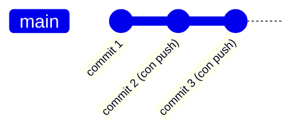

# Practica Git & GitHub Desktop ~don't be afraid~
**Duración estimada:** 4 horas  + 1 reto bonus opcional
**Requisito:** haber tomado la sesión presencial de Git básico

## ¿Por qué este autoestudio?
En la sesión presencial aprendiste el flujo básico guiado paso a paso. Aquí el objetivo es distinto; que practiques **sin que nadie te esté viendo**, te equivoques a propósito, y compruebes que Git casi nunca pierde información de verdad. La meta no es que hagas todo perfecto — es que dejes de tenerle miedo al programa.

**Regla:** todo lo que hagas aquí es en un repositorio desechable. Si algo se ve raro, revuelto o "roto", vas por buen camino.

---

## Antes de empezar 

- [ ] Confirma que tienes Git, GitHub Desktop y VS Code funcionando (los mismos del curso presencial)
- [ ] Crea un repositorio **nuevo y separado** del que usaste en clase, llamado `sandbox-[tu-nombre]`
  - En GitHub Desktop: `File` → `New Repository` → nombre `sandbox-[tu-nombre]`
- [ ] Dentro de ese repo, crea un archivo `notas.md` con cualquier contenido de prueba (no importa qué escribas)
- [ ] Haz un primer commit de ese archivo para tener un punto de partida

> Este repo es tu "campo de tiro". El repo de tu perfil de la clase **no lo toques** en este autoestudio — ese lo dejamos intacto.

---

## Cómo entregar esta tarea

Al final vas a **publicar (push) tu repo `sandbox-[tu-nombre]`** a tu cuenta de GitHub y vas a compartir el link, junto con el archivo `bitacora.md` (lo armas en el último bloque) que debe vivir dentro de ese mismo repo. No necesitas que el código "funcione" ni que el proyecto tenga sentido — lo que se evalúa es la evidencia del proceso, no el resultado.

---

## Reto 1 — Repaso de commits

Sin ver de nuevo la guía de la sesión presencial, intenta lo siguiente de memoria (si te trabas, ahí sí consulta tus notas de clase):

1. Modifica `notas.md` y haz un commit
2. Crea un archivo nuevo `ideas.md` y haz otro commit
3. Modifica ambos archivos a la vez en una sola sesión de edición, y haz **un solo commit** que incluya los dos cambios
4. Ve a la pestaña **History** y confirma que tienes al menos 4 commits en total

**Autoverificación:**

| Debiste lograr | Cómo lo confirmas |
|---|---|
| Al menos 4 commits | Cuéntalos en la pestaña **History** |
| Un commit con 2 archivos modificados a la vez | Haz clic en ese commit — debe mostrar ambos archivos en el diff |
| Mensajes de commit describen lo que hiciste (no genéricos tipo "cambios") | Léelos en voz alta: ¿alguien más entendería qué pasó sin verte trabajar? |

---

## Reto 2 — Ramas independientes

1. Crea una rama `prueba-1` y agrega una sección nueva a `ideas.md`. Haz commit.
2. Regresa a `main` y crea una segunda rama `prueba-2`, edita `notas.md` (una parte **distinta** del archivo que no toques en `prueba-1`). Haz commit.
3. Fusiona `prueba-1` a `main`.
4. Fusiona `prueba-2` a `main`.
5. Crea una tercera rama `prueba-3`, haz un cambio cualquiera, haz commit — pero **no la fusiones**. Déjala ahí, sin fusionar, a propósito.

**Autoverificación:**

| Debiste lograr | Cómo lo confirmas |
|---|---|
| 3 ramas creadas | **Current Branch** → deben aparecer las 3 en la lista |
| 2 fusionadas, 1 sin fusionar | En **History**, el gráfico debe mostrar 2 uniones; `prueba-3` no aparece en la línea de `main` |
| main tiene los cambios de ambas ramas fusionadas | Abre `ideas.md` y `notas.md` — deben tener el contenido de `prueba-1` y `prueba-2` juntos |

> Deja `prueba-3` sin fusionar — la vas a usar más adelante.

---

## Reto 3 — Rómpelo y arréglalo 

Este es el bloque central. Cada micro-misión provoca un problema común **a propósito** y te enseña cómo se arregla. Documenta en tu `bitacora.md` (lo armas al final) qué hiciste en cada una — con 2-3 líneas basta por misión.

### Misión A — Descartar cambios que no quieres 
1. Modifica `notas.md` con texto sin sentido, sin hacer commit
2. En **Changes**, clic derecho sobre el archivo → **Discard changes**
3. Confirma que el archivo volvió a como estaba antes

**Lo que aprendiste:** mientras no hagas commit, Git no "recuerda" nada — puedes tirar el cambio sin dejar rastro.

### Misión B — Deshacer un commit recién hecho 
1. Haz un commit con un mensaje absurdo, ej. `asdkjaskjd`
2. Inmediatamente (sin hacer push ni otro commit), busca el botón **Undo** que aparece justo después de comitear
3. Confirma que el commit desapareció de **History** y los cambios volvieron a **Changes**

**Lo que aprendiste:** un commit sin push todavía es "local y privado" — puedes reescribir tu historia sin que nadie se entere.

### Misión C — Revertir un commit ya subido 
1. Haz un cambio real en `ideas.md`, comitea, y haz **Push origin**
2. Ahora que ya está en GitHub, ve a **History**, clic derecho sobre ese commit → **Revert this commit**
3. Observa que se crea un **commit nuevo** que deshace el cambio (no borra el anterior del historial)

**Lo que aprendiste:** una vez que algo está compartido (push), ya no se puede "desaparecer" — pero sí se puede corregir hacia adelante sin ocultar que existió.

### Misión D — Provócate un conflicto real 
1. Regresa a la rama `prueba-3` que dejaste pendiente en el Reto 2
2. Edita **la misma línea** de `notas.md` que ya modificaste en algún commit de `main`
3. Comitea en `prueba-3`
4. Cambia a `main` → `Branch` → `Merge into Current Branch` → selecciona `prueba-3`
5. GitHub Desktop te va a avisar que hay conflicto. Ábrelo, verás algo así:

```
<<<<<<< main
tu texto en main
=======
tu texto en prueba-3
>>>>>>> prueba-3
```

6. Edita el archivo a mano: borra las marcas y decide qué texto conservar (o ambos)
7. Marca como resuelto y completa el merge

**Lo que aprendiste:** un conflicto no es un error del programa — es Git preguntándote "¿cuál de las dos versiones es la correcta?" porque no puede decidir por ti.

### Misión E — El experimento "borra tu compu" 
1. Asegúrate de que **todo** esté con push hecho a GitHub (revisa que no diga "Push origin" pendiente)
2. Cierra GitHub Desktop
3. Ve al Explorador de archivos / Finder y **borra por completo** la carpeta local de `sandbox-[tu-nombre]`
4. Abre GitHub Desktop de nuevo → `File` → `Clone Repository` → clona `sandbox-[tu-nombre]` desde tu cuenta de GitHub
5. Verifica que todo tu historial de commits sigue intacto en **History**

**Lo que aprendiste:** si ya hiciste push, tu proyecto vive a salvo en GitHub. Tu computadora puede perderse, dañarse o formatearse — el trabajo compartido no desaparece con ella.


*Esto es lo que sigue existiendo en GitHub aunque tu carpeta local desaparezca por completo.*

---

## Reto 4 — Explorando un repositorio ajeno 

Hasta ahora solo has visto el historial de tus propios proyectos. Ahora vas a ver Git "de verdad", en un proyecto que no es tuyo — **sin escribir nada, solo mirando**.

1. En GitHub Desktop: `File` → `Clone Repository` → pestaña **URL**
2. Pega esta URL: `https://github.com/octocat/Hello-World` (repositorio oficial de ejemplo de GitHub)
3. Clónalo en cualquier carpeta temporal
4. Explora su pestaña **History**: ¿cuántos commits tiene?, ¿quién los hizo?
5. Abre el proyecto en VS Code y usa **Git Graph** (`Ctrl+Shift+P` → `Git Graph: View Git Graph`) para ver su árbol de ramas
6. En GitHub (navegador), abre la pestaña **Actions** de ese mismo repositorio (o de otro público más activo, como `https://github.com/microsoft/vscode`) y entra a cualquier "workflow run" reciente. No necesitas entender el archivo YAML todavía — solo obsérvalo.
7. Si el repo tiene pestaña **Projects**, ábrela y mira cómo organizan sus tareas en un tablero tipo Kanban.

> No necesitas hacer commits ni push aquí — es solo observación. Si quieres, elige tú mismo otro repositorio público pequeño que te llame la atención (de algún compañero, de una librería que uses, etc.) y repite el ejercicio con ese.

> Los pasos 6 y 7 son solo para que tu ojo ya haya visto esas pantallas antes — Actions y Projects los vas a usar de verdad en la sesión avanzada.

**Pregunta para tu bitácora:** ¿el historial de un proyecto real se parece a lo que imaginabas, o es más desordenado/ordenado de lo que pensabas?

---

## Reto 5 (opcional) — Asómate a la terminal y a GitHub CLI 

> Este reto **no cuenta** dentro de las 4 horas obligatorias. Hazlo si te sobra tiempo o si quieres llegar con ventaja a la próxima sesión, que será 100% en terminal.

Todo lo que has hecho hasta ahora con clics en GitHub Desktop tiene un comando equivalente. Vas a comprobarlo:

1. Abre la terminal integrada de VS Code (`` Ctrl+` ``) o la terminal de tu sistema, y navega a la carpeta de tu repo: `cd ruta/a/sandbox-tu-nombre`
2. Corre estos dos comandos y compara lo que ves con la pestaña **History** de GitHub Desktop — es la misma información, en texto:
   ```bash
   git status
   git log --oneline --graph --all
   ```
3. Modifica `notas.md`, y esta vez sube el cambio **sin abrir GitHub Desktop**, solo desde terminal:
   ```bash
   git add notas.md
   git commit -m "Commit hecho desde terminal"
   git push
   ```
4. Abre GitHub Desktop y confirma que el commit aparece ahí también, sin que hayas tocado ningún botón de la app.
5. *(Opcional, si ya tienes GitHub CLI instalado)* corre `gh repo view` para ver info de tu repo desde la terminal, y `gh pr list` para ver tus pull requests sin abrir el navegador.

**Lo que aprendiste:** GitHub Desktop no hace magia — cada botón corresponde a un comando. En la sesión avanzada vas a usar esos comandos directamente, sin la interfaz gráfica de por medio.

---

## Entregable final — Bitácora de autoestudio
Crea un archivo `bitacora.md` dentro de tu repo `sandbox-[tu-nombre]`, con esta estructura:

```markdown
# Bitácora de autoestudio — [tu nombre]

## Checklist de retos completados

- [ ] Reto 1 — Repaso de commits
- [ ] Reto 2 — Ramas independientes
- [ ] Reto 3A — Discard changes
- [ ] Reto 3B — Undo commit
- [ ] Reto 3C — Revert commit
- [ ] Reto 3D — Conflicto resuelto
- [ ] Reto 3E — Borrar y re-clonar
- [ ] Reto 4 — Exploración de repo ajeno
- [ ] Reto 5 (bonus) — Terminal y GitHub CLI

## Lo que pasó en cada misión de "Rómpelo y arréglalo"

### Misión A — Discard
(2-3 líneas: qué hiciste y qué pasó)

### Misión B — Undo commit


### Misión C — Revert


### Misión D — Conflicto


### Misión E — Borrar y re-clonar


## Reflexión

**¿Cuál de las 5 misiones te dio más miedo antes de hacerla, y por qué ya no?**


**¿Qué harías distinto si mañana rompes algo en un proyecto real de la escuela?**


**Una pregunta que te quedó pendiente para el instructor:**


## Repo ajeno explorado (Reto 4)

- Repositorio: 
- ¿Qué notaste en su historial?

## (Bonus) Terminal y GitHub CLI — solo si hiciste el Reto 5

**¿Cómo se sintió hacer un commit desde la terminal comparado con GitHub Desktop?**

```

Haz commit de `bitacora.md`, **Push origin**, y comparte el link de tu repositorio `sandbox-[tu-nombre]` como entrega de la tarea.

---
